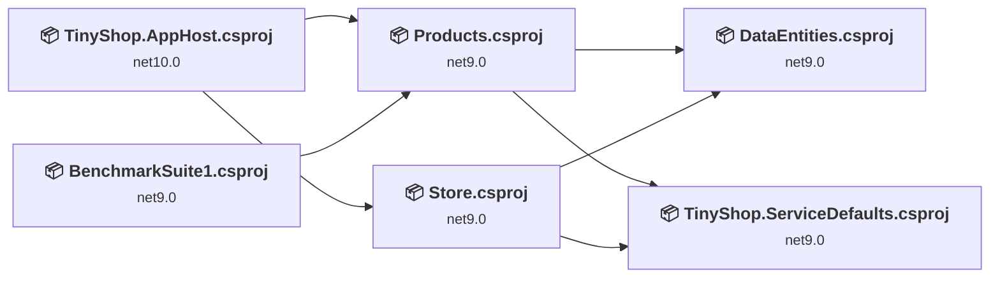
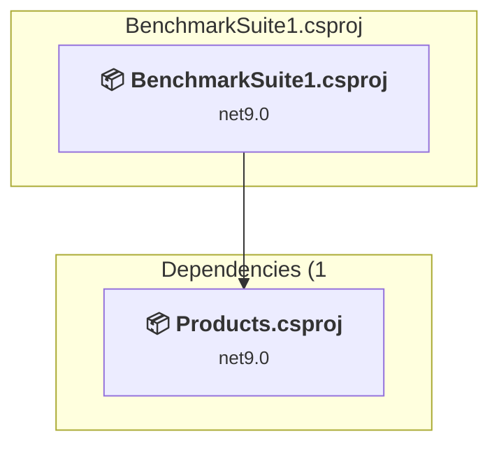
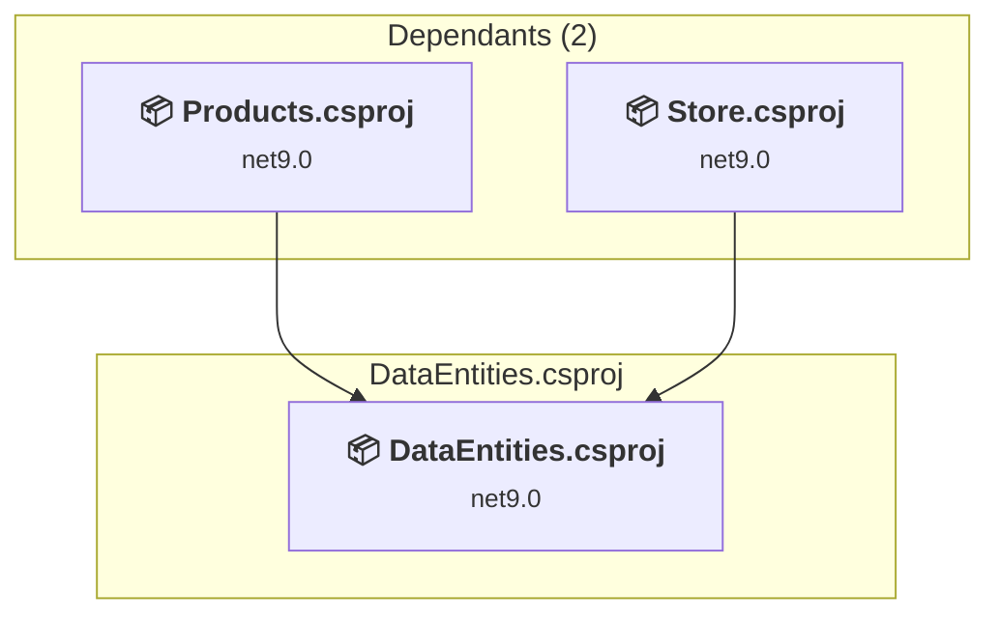
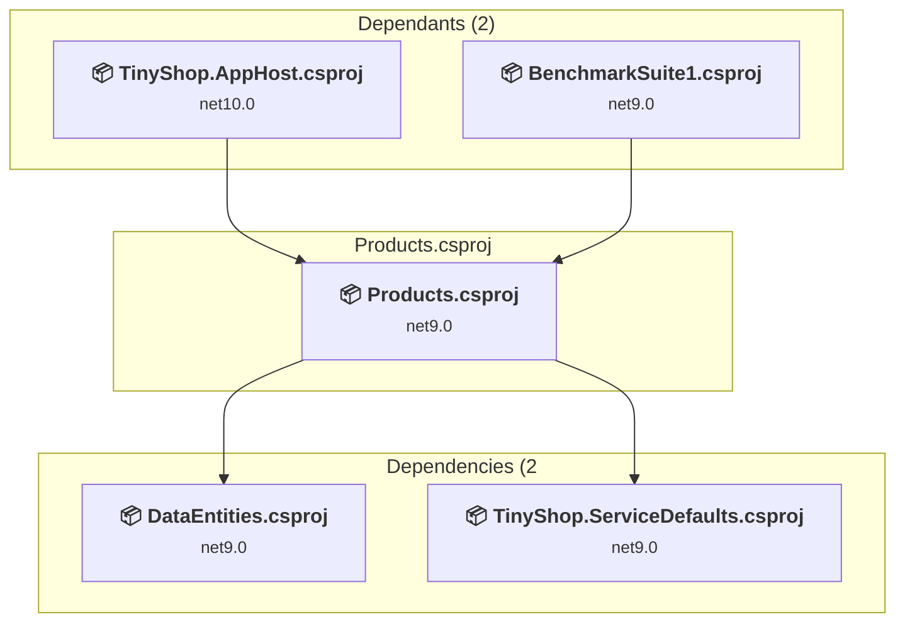
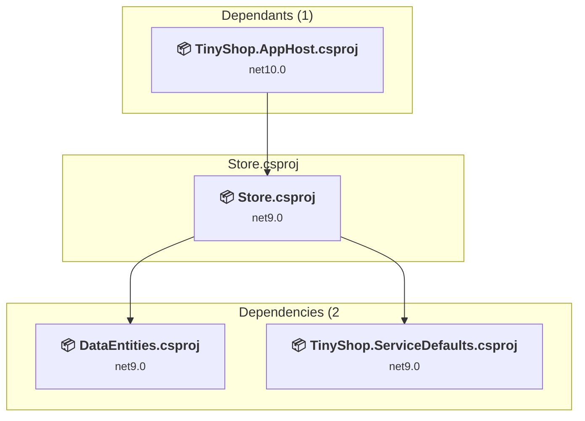
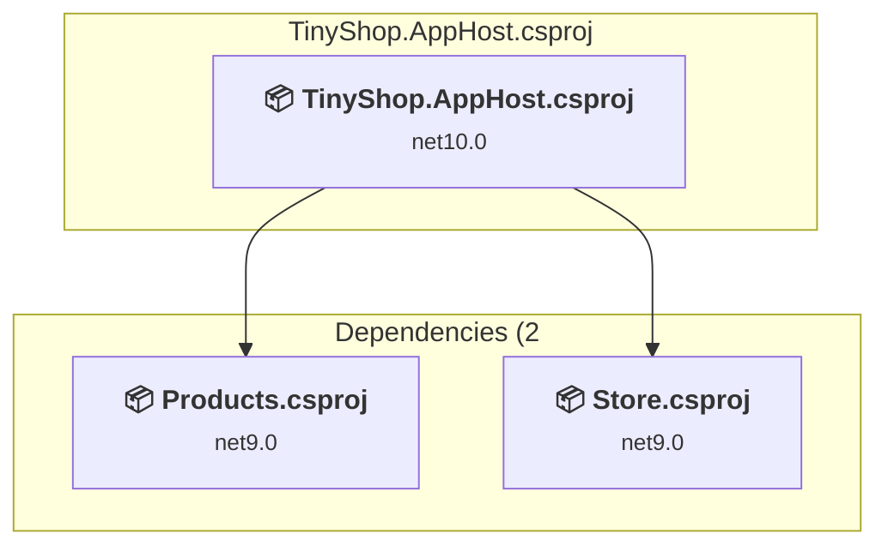
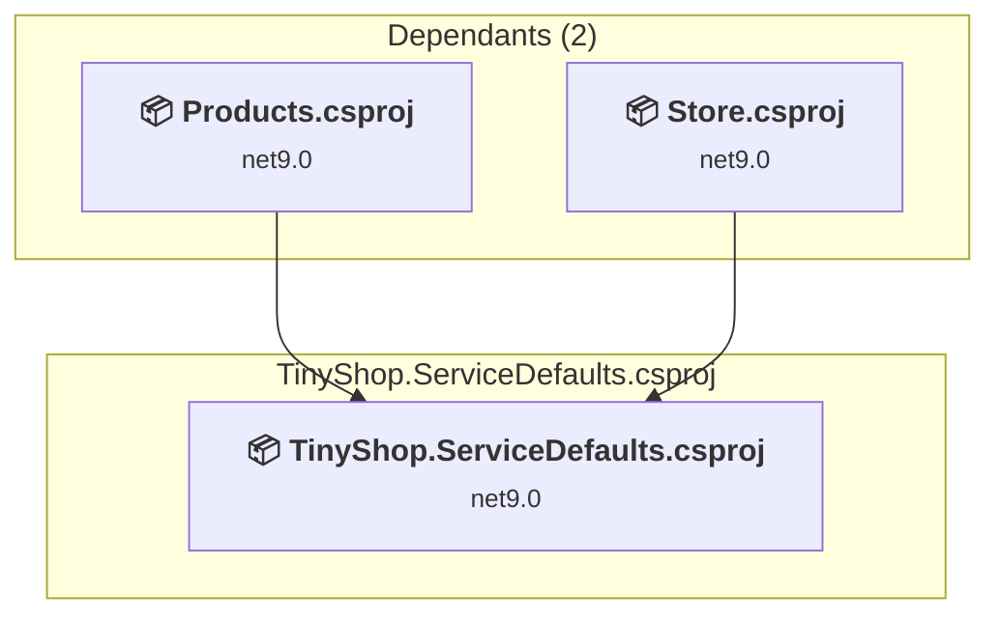

# Projects and dependencies analysis

This document provides a comprehensive overview of the projects and their dependencies in the context of upgrading to .NETCoreApp,Version=v10.0.

## Table of Contents

- [Executive Summary](#executive-Summary)
  - [Highlevel Metrics](#highlevel-metrics)
  - [Projects Compatibility](#projects-compatibility)
  - [Package Compatibility](#package-compatibility)
  - [API Compatibility](#api-compatibility)
- [Aggregate NuGet packages details](#aggregate-nuget-packages-details)
- [Top API Migration Challenges](#top-api-migration-challenges)
  - [Technologies and Features](#technologies-and-features)
  - [Most Frequent API Issues](#most-frequent-api-issues)
- [Projects Relationship Graph](#projects-relationship-graph)
- [Project Details](#project-details)

  - [BenchmarkSuite1\BenchmarkSuite1.csproj](#benchmarksuite1benchmarksuite1csproj)
  - [DataEntities\DataEntities.csproj](#dataentitiesdataentitiescsproj)
  - [Products\Products.csproj](#productsproductscsproj)
  - [Store\Store.csproj](#storestorecsproj)
  - [TinyShop.AppHost\TinyShop.AppHost.csproj](#tinyshopapphosttinyshopapphostcsproj)
  - [TinyShop.ServiceDefaults\TinyShop.ServiceDefaults.csproj](#tinyshopservicedefaultstinyshopservicedefaultscsproj)

## Executive Summary

### Highlevel Metrics

| Metric | Count | Status |
| :--- | :---: | :--- |
| Total Projects | 6 | 5 require upgrade |
| Total NuGet Packages | 16 | 10 need upgrade |
| Total Code Files | 12 |  |
| Total Code Files with Incidents | 9 |  |
| Total Lines of Code | 969 |  |
| Total Number of Issues | 26 |  |
| Estimated LOC to modify | 11+ | at least 1.1% of codebase |

### Projects Compatibility

| Project | Target Framework | Difficulty | Package Issues | API Issues | Est. LOC Impact | Description |
| :--- | :---: | :---: | :---: | :---: | :---: | :--- |
| [BenchmarkSuite1\BenchmarkSuite1.csproj](#benchmarksuite1benchmarksuite1csproj) | net9.0 | 🟢 Low | 1 | 0 |  | DotNetCoreApp, Sdk Style = True |
| [DataEntities\DataEntities.csproj](#dataentitiesdataentitiescsproj) | net9.0 | 🟢 Low | 0 | 0 |  | ClassLibrary, Sdk Style = True |
| [Products\Products.csproj](#productsproductscsproj) | net9.0 | 🟢 Low | 5 | 0 |  | AspNetCore, Sdk Style = True |
| [Store\Store.csproj](#storestorecsproj) | net9.0 | 🟢 Low | 0 | 11 | 11+ | AspNetCore, Sdk Style = True |
| [TinyShop.AppHost\TinyShop.AppHost.csproj](#tinyshopapphosttinyshopapphostcsproj) | net10.0 | ✅ None | 0 | 0 |  | DotNetCoreApp, Sdk Style = True |
| [TinyShop.ServiceDefaults\TinyShop.ServiceDefaults.csproj](#tinyshopservicedefaultstinyshopservicedefaultscsproj) | net9.0 | 🟢 Low | 4 | 0 |  | ClassLibrary, Sdk Style = True |

### Package Compatibility

| Status | Count | Percentage |
| :--- | :---: | :---: |
| ✅ Compatible | 6 | 37.5% |
| ⚠️ Incompatible | 0 | 0.0% |
| 🔄 Upgrade Recommended | 10 | 62.5% |
| ***Total NuGet Packages*** | ***16*** | ***100%*** |

### API Compatibility

| Category | Count | Impact |
| :--- | :---: | :--- |
| 🔴 Binary Incompatible | 0 | High - Require code changes |
| 🟡 Source Incompatible | 1 | Medium - Needs re-compilation and potential conflicting API error fixing |
| 🔵 Behavioral change | 10 | Low - Behavioral changes that may require testing at runtime |
| ✅ Compatible | 3585 |  |
| ***Total APIs Analyzed*** | ***3596*** |  |

## Aggregate NuGet packages details

| Package | Current Version | Suggested Version | Projects | Description |
| :--- | :---: | :---: | :--- | :--- |
| Aspire.Hosting.AppHost | 13.0.2 |  | [TinyShop.AppHost.csproj](#tinyshopapphosttinyshopapphostcsproj) | ✅Compatible |
| BenchmarkDotNet | 0.15.2 |  | [BenchmarkSuite1.csproj](#benchmarksuite1benchmarksuite1csproj) | ✅Compatible |
| Microsoft.EntityFrameworkCore.InMemory | 9.0.6 | 10.0.3 | [BenchmarkSuite1.csproj](#benchmarksuite1benchmarksuite1csproj) | Ein NuGet-Paketupgrade wird empfohlen |
| Microsoft.EntityFrameworkCore.SqlServer | 9.0.6 | 10.0.3 | [Products.csproj](#productsproductscsproj) | Ein NuGet-Paketupgrade wird empfohlen |
| Microsoft.EntityFrameworkCore.Tools | 9.0.6 | 10.0.3 | [Products.csproj](#productsproductscsproj) | Ein NuGet-Paketupgrade wird empfohlen |
| Microsoft.Extensions.Http.Resilience | 9.6.0 | 10.3.0 | [TinyShop.ServiceDefaults.csproj](#tinyshopservicedefaultstinyshopservicedefaultscsproj) | Ein NuGet-Paketupgrade wird empfohlen |
| Microsoft.Extensions.ServiceDiscovery | 9.3.1 | 10.3.0 | [TinyShop.ServiceDefaults.csproj](#tinyshopservicedefaultstinyshopservicedefaultscsproj) | Ein NuGet-Paketupgrade wird empfohlen |
| Microsoft.VisualStudio.DiagnosticsHub.BenchmarkDotNetDiagnosers | 18.3.36726.2 |  | [BenchmarkSuite1.csproj](#benchmarksuite1benchmarksuite1csproj) | ✅Compatible |
| Microsoft.VisualStudio.Web.CodeGeneration.Design | 9.0.0 | 10.0.2 | [Products.csproj](#productsproductscsproj) | Ein NuGet-Paketupgrade wird empfohlen |
| OpenTelemetry.Exporter.OpenTelemetryProtocol | 1.12.0 |  | [TinyShop.ServiceDefaults.csproj](#tinyshopservicedefaultstinyshopservicedefaultscsproj) | ✅Compatible |
| OpenTelemetry.Extensions.Hosting | 1.12.0 |  | [TinyShop.ServiceDefaults.csproj](#tinyshopservicedefaultstinyshopservicedefaultscsproj) | ✅Compatible |
| OpenTelemetry.Instrumentation.AspNetCore | 1.12.0 | 1.15.0 | [TinyShop.ServiceDefaults.csproj](#tinyshopservicedefaultstinyshopservicedefaultscsproj) | Ein NuGet-Paketupgrade wird empfohlen |
| OpenTelemetry.Instrumentation.Http | 1.12.0 | 1.15.0 | [TinyShop.ServiceDefaults.csproj](#tinyshopservicedefaultstinyshopservicedefaultscsproj) | Ein NuGet-Paketupgrade wird empfohlen |
| OpenTelemetry.Instrumentation.Runtime | 1.12.0 |  | [TinyShop.ServiceDefaults.csproj](#tinyshopservicedefaultstinyshopservicedefaultscsproj) | ✅Compatible |
| System.Formats.Asn1 | 9.0.6 | 10.0.3 | [Products.csproj](#productsproductscsproj) | Ein NuGet-Paketupgrade wird empfohlen |
| System.Text.Json | 9.0.6 | 10.0.3 | [Products.csproj](#productsproductscsproj) | Ein NuGet-Paketupgrade wird empfohlen |

## Top API Migration Challenges

### Technologies and Features

| Technology | Issues | Percentage | Migration Path |
| :--- | :---: | :---: | :--- |

### Most Frequent API Issues

| API | Count | Percentage | Category |
| :--- | :---: | :---: | :--- |
| T:System.Uri | 4 | 36.4% | Behavioral Change |
| T:System.Net.Http.HttpContent | 3 | 27.3% | Behavioral Change |
| M:System.Uri.#ctor(System.String) | 2 | 18.2% | Behavioral Change |
| M:System.TimeSpan.FromMinutes(System.Int64) | 1 | 9.1% | Source Incompatible |
| M:Microsoft.AspNetCore.Builder.ExceptionHandlerExtensions.UseExceptionHandler(Microsoft.AspNetCore.Builder.IApplicationBuilder,System.String,System.Boolean) | 1 | 9.1% | Behavioral Change |

## Projects Relationship Graph

Legend:
📦 SDK-style project
⚙️ Classic project

## Project Details

### BenchmarkSuite1\BenchmarkSuite1.csproj

#### Project Info

- **Current Target Framework:** net9.0
- **Proposed Target Framework:** net10.0
- **SDK-style**: True
- **Project Kind:** DotNetCoreApp
- **Dependencies**: 1
- **Dependants**: 0
- **Number of Files**: 3
- **Number of Files with Incidents**: 1
- **Lines of Code**: 212
- **Estimated LOC to modify**: 0+ (at least 0.0% of the project)

#### Dependency Graph

Legend:
📦 SDK-style project
⚙️ Classic project

### API Compatibility

| Category | Count | Impact |
| :--- | :---: | :--- |
| 🔴 Binary Incompatible | 0 | High - Require code changes |
| 🟡 Source Incompatible | 0 | Medium - Needs re-compilation and potential conflicting API error fixing |
| 🔵 Behavioral change | 0 | Low - Behavioral changes that may require testing at runtime |
| ✅ Compatible | 356 |  |
| ***Total APIs Analyzed*** | ***356*** |  |

### DataEntities\DataEntities.csproj

#### Project Info

- **Current Target Framework:** net9.0
- **Proposed Target Framework:** net10.0
- **SDK-style**: True
- **Project Kind:** ClassLibrary
- **Dependencies**: 0
- **Dependants**: 2
- **Number of Files**: 1
- **Number of Files with Incidents**: 1
- **Lines of Code**: 47
- **Estimated LOC to modify**: 0+ (at least 0.0% of the project)

#### Dependency Graph

Legend:
📦 SDK-style project
⚙️ Classic project

### API Compatibility

| Category | Count | Impact |
| :--- | :---: | :--- |
| 🔴 Binary Incompatible | 0 | High - Require code changes |
| 🟡 Source Incompatible | 0 | Medium - Needs re-compilation and potential conflicting API error fixing |
| 🔵 Behavioral change | 0 | Low - Behavioral changes that may require testing at runtime |
| ✅ Compatible | 701 |  |
| ***Total APIs Analyzed*** | ***701*** |  |

### Products\Products.csproj

#### Project Info

- **Current Target Framework:** net9.0
- **Proposed Target Framework:** net10.0
- **SDK-style**: True
- **Project Kind:** AspNetCore
- **Dependencies**: 2
- **Dependants**: 2
- **Number of Files**: 14
- **Number of Files with Incidents**: 1
- **Lines of Code**: 364
- **Estimated LOC to modify**: 0+ (at least 0.0% of the project)

#### Dependency Graph

Legend:
📦 SDK-style project
⚙️ Classic project

### API Compatibility

| Category | Count | Impact |
| :--- | :---: | :--- |
| 🔴 Binary Incompatible | 0 | High - Require code changes |
| 🟡 Source Incompatible | 0 | Medium - Needs re-compilation and potential conflicting API error fixing |
| 🔵 Behavioral change | 0 | Low - Behavioral changes that may require testing at runtime |
| ✅ Compatible | 686 |  |
| ***Total APIs Analyzed*** | ***686*** |  |

### Store\Store.csproj

#### Project Info

- **Current Target Framework:** net9.0
- **Proposed Target Framework:** net10.0
- **SDK-style**: True
- **Project Kind:** AspNetCore
- **Dependencies**: 2
- **Dependants**: 1
- **Number of Files**: 19
- **Number of Files with Incidents**: 5
- **Lines of Code**: 211
- **Estimated LOC to modify**: 11+ (at least 5.2% of the project)

#### Dependency Graph

Legend:
📦 SDK-style project
⚙️ Classic project

### API Compatibility

| Category | Count | Impact |
| :--- | :---: | :--- |
| 🔴 Binary Incompatible | 0 | High - Require code changes |
| 🟡 Source Incompatible | 1 | Medium - Needs re-compilation and potential conflicting API error fixing |
| 🔵 Behavioral change | 10 | Low - Behavioral changes that may require testing at runtime |
| ✅ Compatible | 1720 |  |
| ***Total APIs Analyzed*** | ***1731*** |  |

### TinyShop.AppHost\TinyShop.AppHost.csproj

#### Project Info

- **Current Target Framework:** net10.0✅
- **SDK-style**: True
- **Project Kind:** DotNetCoreApp
- **Dependencies**: 2
- **Dependants**: 0
- **Number of Files**: 1
- **Lines of Code**: 9
- **Estimated LOC to modify**: 0+ (at least 0.0% of the project)

#### Dependency Graph

Legend:
📦 SDK-style project
⚙️ Classic project

### API Compatibility

| Category | Count | Impact |
| :--- | :---: | :--- |
| 🔴 Binary Incompatible | 0 | High - Require code changes |
| 🟡 Source Incompatible | 0 | Medium - Needs re-compilation and potential conflicting API error fixing |
| 🔵 Behavioral change | 0 | Low - Behavioral changes that may require testing at runtime |
| ✅ Compatible | 0 |  |
| ***Total APIs Analyzed*** | ***0*** |  |

### TinyShop.ServiceDefaults\TinyShop.ServiceDefaults.csproj

#### Project Info

- **Current Target Framework:** net9.0
- **Proposed Target Framework:** net10.0
- **SDK-style**: True
- **Project Kind:** ClassLibrary
- **Dependencies**: 0
- **Dependants**: 2
- **Number of Files**: 1
- **Number of Files with Incidents**: 1
- **Lines of Code**: 126
- **Estimated LOC to modify**: 0+ (at least 0.0% of the project)

#### Dependency Graph

Legend:
📦 SDK-style project
⚙️ Classic project

### API Compatibility

| Category | Count | Impact |
| :--- | :---: | :--- |
| 🔴 Binary Incompatible | 0 | High - Require code changes |
| 🟡 Source Incompatible | 0 | Medium - Needs re-compilation and potential conflicting API error fixing |
| 🔵 Behavioral change | 0 | Low - Behavioral changes that may require testing at runtime |
| ✅ Compatible | 122 |  |
| ***Total APIs Analyzed*** | ***122*** |  |

